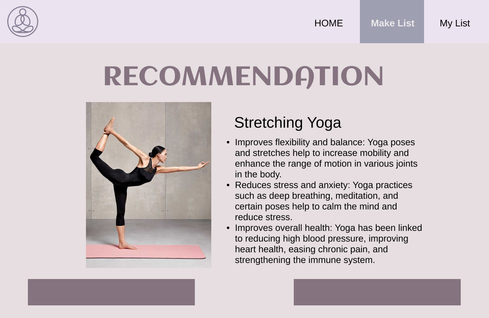

# Yoga Project Tracker

## Overview
Yoga Project Tracker is a simple single-page application (SPA) that helps you choose and record yoga practice. It's built using basic HTML, CSS and JavaScript, and uses `localStorage` for data saving.

### Version Control
This project uses git and github for tracking changes and managing development. Please see the github repository here: [URl to githubrepo]

## Features
- **Dynamic Recommendations** : Users can select their preferences from a drop-down and the system will dynamically generate yoga program recommendations based on the selected criteria.
- **Instant Feedback** : After selecting their preferences, users receive immediate feedback with detailed information about the recommended yoga classes.
- **Increment Count** : There is an "Add to List" button, and the history record will increase every time it is clicked.
- **Delete Data** : There is a "Delete" button next to each history record, and the corresponding record will be removed when it is clicked.
- **Data Persistence** : The application uses `localStorage` to remember all added records even if the page is refreshed or reopened.
- **Responsive Design** : The application is designed to be responsive, ensuring it can work across various devices, including desktops, tablets, and smartphones.

## Development Process

### Prototype Design Iterations

#### Initial Prototype
The initial prototype focused on recreating the wire frame. The main goal was to create a simple and intuitive interface that clearly communicates the functions of each accessory. For users to select their favorite yoga and receive recommendations.




#### First Iteration
Based on feedback from students and tutors, the first iteration included a higher fidelity background image and the "Recommendation Page" was changed from a page to a pop-up window.


#### Second Iteration
The second iteration completed the "Recommendation popup" and "My List" interface with better visual effects. In addition, responsive design principles were introduced to ensure that the application runs on different devices.


 
 
#### - Logo Design


#### - Symbolic Icon


### Bootstrap Code Inspiration
To improve the code for interactive modes in my project, I looked into Bootstrap for inspiration. Here are the links to Bootstrap and my code

```html
<!-- Bootstrap CSS -->
<link href="https://stackpath.bootstrapcdn.com/bootstrap/4.5.2/css/bootstrap.min.css" rel="stylesheet">

<!-- Dropdown for selecting Action Type using Bootstrap -->
<div class="form-group">
  <label for="ActionType">Action Type</label>
  <select class="form-control" id="ActionType" name="ActionType">
    <option value="1">Stretching and Relaxation Yoga</option>
    <option value="2">Strength and Balance Yoga</option>
    <option value="3">Vitality Restoration Yoga</option>
  </select>
</div>

<!-- Dropdown for selecting Duration using Bootstrap -->
<div class="form-group">
  <label for="Duration">Duration</label>
  <select class="form-control" id="Duration" name="Duration">
    <option value="10 min">Short Length ( 10 min )</option>
    <option value="30min-1h">Standard Length ( 30min-1h )</option>
    <option value="1-1.5h">Long Session ( 1-1.5h )</option>
  </select>
</div>

<!-- Dropdown for selecting Difficulty using Bootstrap -->
<div class="form-group">
  <label for="Difficulty">Difficulty</label>
  <select class="form-control" id="Difficulty" name="Difficulty">
    <option value="1">Beginner</option>
    <option value="2">Intermediate</option>
    <option value="3">Advanced</option>
  </select>
</div>
 ```

### Initial Setup

#### Tools and Technologies
- **HTML**: Markup language used for structuring the application.
- **CSS**: Styling language used for designing the UI.
- **JavaScript**: Programming language used for application logic and interaction.
- **Node.js**: JavaScript runtime environment used for server-side development.
- **Express.js**: Web application framework for Node.js used to serve the application.

## Usage
There are two options:

1. View the website online at the following URL: [http://localhost:1234]
2. 0pen the index.html`file in your web browser to start usingthe application.
   
After opening the page, click "Make List" to start. 
Select the drop-down menu according to your preferences, and then click "Submit". According to the pop-up, if you want to reselect, click "Change Preferences" and the page will return to the "Make List" interface. 
If you are satisfied with the recommended results, click "Add To List" and the page will jump to the "My List" interface. If you want to delete existing records, click the recycle bin icon to delete them.

## Limitations
- **Mobile Responsiveness**: The app is optimized for mobile devices, but some complex interactions may not be as seamless on smaller screens compared to the desktop version, such as the "pop-up" and "My List" interfaces.

- **Limited customization** : Users have limited options to customize Yoga. Future versions may include more optional items and customization modes to enhance the user experience.
  
- **Visual effect** : The project pictures on the pop-up and My List interfaces are unified, which reduces the visual effect. Different pictures can be added later to increase the distinction and visual effect.

## AI usage Acknowledgments
This project was initially generated with the help of chatGPT4 withthe following prompts.

- Hi, based on the layout of these pictures, how should I organize a single-page framework? How can I use an HTML tag to implement this page?
  
- What is the code to create a navigation bar with multiple buttons?

- How should the navigation button implement the page switching function after clicking?

- Hi, Please tell me how to use CSS to achieve responsive design on different devices?

- How to change the style of a button when it is clicked?

- How do I use localStorage to store user data?

- How do I read and display user-saved data from localStorage?
